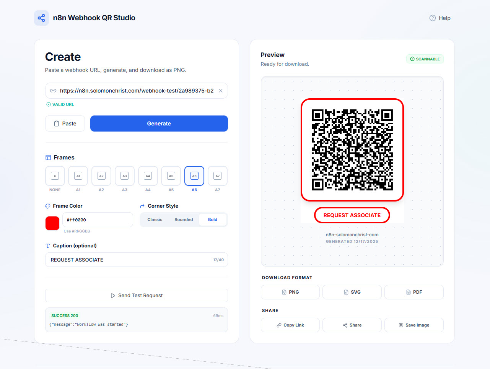
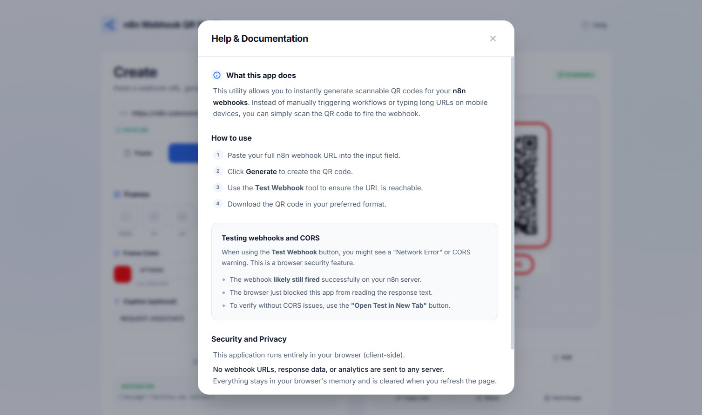
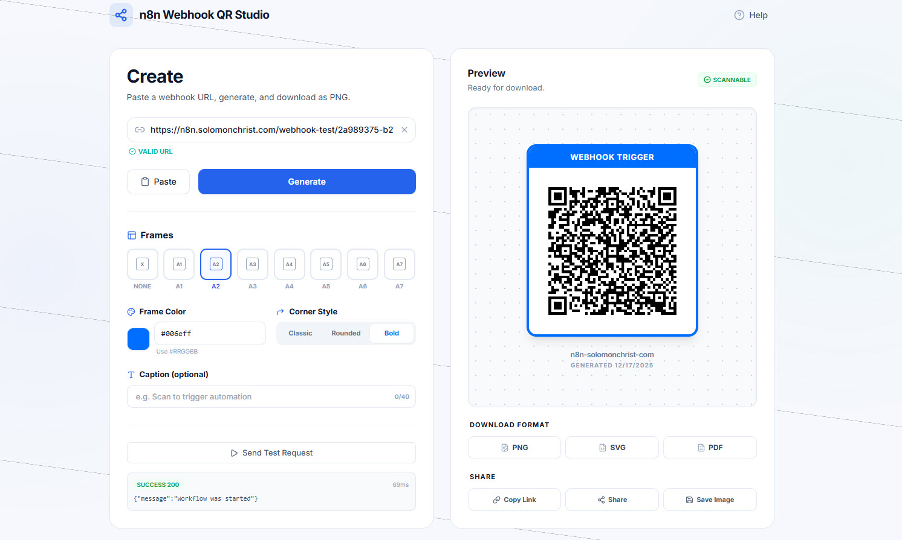

# n8n Webhook QR Studio

> Generate scannable QR codes that instantly trigger your n8n webhooks, with frames, captions, exports, and built-in webhook testing.

**n8n Webhook QR Studio** is an open-source web app for n8n users and developers who want a fast, clean way to turn any n8n Webhook URL into a QR code that can be scanned by customers or staff to fire automations. It includes a built-in “Test Webhook” tool, multiple export formats (PNG, SVG, PDF), and lightweight branding controls like frames, captions, and custom hex colors.

**NOTE:** This was a Vibe Coded project by **Solomon Christ**, and updates are the responsibility of community contributors.

---

## 📸 Demo & Screenshots




---

## 🎯 Vision

I created this tool for **n8n users, developers, and business owners** who want to deploy real-world automations using QR codes, without needing a custom app. The goal is simple: **paste a webhook, generate a QR, scan it, automation runs.**

---

## ❓ Why Was This Made?

QR codes are everywhere, but triggering automations still often requires:
- Long URLs and awkward mobile typing
- Custom apps or complicated deployments
- No easy way to test a webhook before printing and distributing codes
- Lack of clean branding options for professional use

**This app solves those problems by providing a single, clean workflow:**
- Paste an n8n Webhook URL
- Generate a scannable QR code
- Test the webhook instantly
- Export or share the QR for real-world use

---

## ✨ Features

- 🔗 **Webhook to QR Generator**
  - Paste any valid `http://` or `https://` webhook URL and generate a QR code that points to it.

- 🧪 **Built-in Webhook Testing (GET)**
  - Trigger the webhook manually and view status code, timing, and response preview.

- 🖼️ **Frames + Caption**
  - Add a frame style and an optional caption like “Scan for assistance” for real-world signage.

- 🎨 **Custom Frame Color (Hex)**
  - Choose a precise brand color via color picker and manual hex entry (`#RRGGBB`).

- ⌟ **Corner Style**
  - Choose a corner look for frames: `Classic`, `Rounded`, `Bold`.

- 📦 **Export Formats**
  - **PNG** for screens and sharing
  - **SVG** for vector workflows
  - **PDF** for print-ready output

- 📖 **Help & Documentation Modal**
  - In-app guidance including CORS notes and usage steps.

- 🔒 **Privacy-First**
  - Runs client-side, no accounts, no tracking, no server storage.

---

## 🧠 Real-World Use Cases

- Retail store QR for “Call staff for help”
- QR to trigger a gate, door, or device automation (via n8n workflow)
- Event check-in triggers
- Facility maintenance requests
- Restaurant table service triggers
- Warehouse task dispatch triggers

---

## 🛠️ Tech Stack

- **Frontend:** React (or equivalent SPA), TypeScript (recommended), Tailwind CSS (recommended)
- **QR Generation:** Client-side QR library
- **PDF Export:** Client-side PDF library
- **Storage:** None (core app), optional local storage only if you add a library later
- **Deployment:** Static hosting, works in any modern browser

---

## 📫 Support

Project Email: n8ndash@gmail.com (All support, security, bugs, feature requests, etc. here please)

Current Contributors: Solomon Christ

Please join my Skool page and Learn More about AI + Automation: [Learn Automation](https://www.skool.com/learn-automation/about)

n8n Community Link: https://community.n8n.io/t/n8ndash-an-open-source-dashboard-for-n8n/

Add Me To LinkedIn: https://www.linkedin.com/in/solomonchristai/

Follow Me On YouTube: https://www.youtube.com/@SolomonChristAI

---

## 🚀 Quick Start

1. **Clone the repo:**
   ```bash
   git clone https://github.com/SolomonChrist/REPLACE_WITH_REPO.git
   cd REPLACE_WITH_REPO
